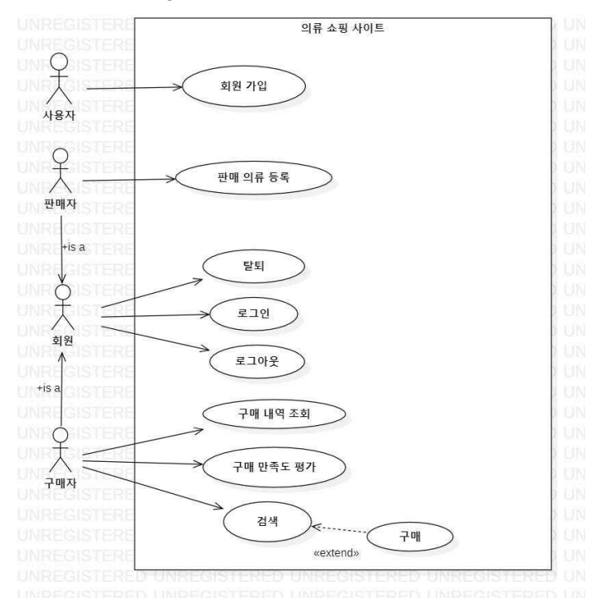

#  쇼핑몰 프로젝트

   
  
   

## 프로젝트 소개
요구사항에 맞춰 쇼핑몰 기능을 구현했다.
 
## 개요
프로젝트에서는 의류 쇼핑 사이트를 개발한다. 이 사이트는 각 회원이 의류 상품을 등록해서 판매할 수 있고 다른 회원이 등록한 의류 상품들을 구매할 수 있다. 
## 요구사항
- 회원 가입 기능 : 사용자는 의류 쇼핑 사이트 사용 권한을 얻기 위해서 회원 가입을 해야 한다. 자신의 기본 정보(이름, 주민번호, 주소, 이메일 등)과 ID/Password를 입력해야 한다. 
- 회원 탈퇴 기능 : 탈퇴를 원하는 회원은이 사이트에서 탈퇴할 수 있다. 탈퇴와 동시에 시스템의 사용 권한은 소멸된다. 단, 회원은 등록한 상품이 하나도 없는 상태에서 탈퇴할 수 있다. 
- 로그인/로그아웃 기능 :  회원은 등록한 ID와 password로 사이트에 로그인해야 한다. 회원이 로그아웃하면 프로그램은 자동으로 종료된다.
- 판매 의류 등록 및 조회/수정 기능 : 회원은 판매하려는 의류를 등록할 수 있다. 등록 시 상품명, 제작회사명, 가격, 수량, 추가상품, 추가상품 가격, 판매 종료일 등의 정보를 입력해야 한다. 또한 각 회원은 자신이 등록한 판매 중인 의류 상품 리스트를 조회할 수 있고 특정 상품을 선택한 후에 그 상품에 대한 모든 항목을 수정할 수 있다.
- 판매 완료된 상품 내역 조회 기능 : 회원은 자신이 판매 완료한 의류 상품을 조회할 수 있다. 판매 완료한 상품은 판매 종료일이 지났거나 남은 수량이 0이 된 상품을 의미한다. 이때 상품명의 오름차순으로 정렬해서 출력하며 각 상품에 대해 상품명, 제작회사명, 가격, 판매된 수량, 평균 구매만족도를 출력한다.
- 상품 정보 조회 및 상품 구매 기능 : 회원이 검색 조건(상품명, 평균 구매만족도 중에 하나)을 선택하여 입력하면 이에 해당하는 상품 리스트(상품명 및 평균 구매만족도 포함)를 출력한다. 디폴트 정렬 기준은 상품명의 오름차순이며 사용자가 평균 구매만족도로 변경할 수 있다. 출력된 상품 중에서 구매를 원하는 상품을 선택하면 해당 상품의 상세한 정보(판매자, 상품명, 제작회사명, 가격, 남은 수량, 추가상품, 추가상품 가격, 판매 종료일, 평균 구매만족도)가 출력되며 즉시 결제한 후 구매 할 수 있다. 
- 결제 기능 : 결제 시 포인트 사용을 선택할 수 있다. 포인트는 3000점 이상이 적립되어 있는 경우에 사용 가능하다.
- 포인트 적립 기능 : 구입 금액의 1%를 포인트로 적립해 주며 환불이 되는 경우에는 다시 사용될 수 있도록 반환된다.
- 추가 상품 구매 기능 : 상품 구매 시 추가 상품으로 등록한 물품도 선택해서 같이 구매할 수 있다. 이 경우 추가 상품의 금액만큼 증가된 가격으로 총 구매금액이 결정된다. 
- 상품 구매 내역 관리 기능 : 회원은 구매 내역(상품명, 제작회사명, 판매자, 가격, 평균 구매만족도, 구매일)을 조회할 수 있다. 이때 상품명의 오름차순으로 정렬해서 출력한다. 조회된 구매 내역 중에서 하나의 상품을 선택하여 구매만족도를 평가하거나 구입 후 4주가 지나지 않은 상품의 경우 환불을 신청할 수 있다. 환불을 신청하는 경우 택배사에 자동으로 물품 수거 신청이 요청된다.
- 상품 구매 내역 삭제 기능 : 3개월이 지난 구매 거래내역부터 임의로 삭제가 가능하며 그 이전의 거래내역은 임의로 삭제가 불가능하다. 또한 6개월이 지난 거래내역은 자동으로 삭제된다.
- 상품 판매/구매 통계 기능 : 회원이 판매한 상품에 대한 총액 및 평균 구매만족도와 구매한 상품에 대한 총액 및 평균 구매만족도를 출력한다. 이때, 삭제된 구매 내역은 통계에서 제외한다. 또한 매월 말일에 모든 회원들에게 그 달에 대한 판매 및 구매 통계 정보를 이메일로 공지된다.

 

 

# 구현 내용

## Requirement list
요구사항 분석 후 Requirement list 작성하여 문서화
|No.|Requirement|Use Case|
|-|--------|-----|
|1|회원이 등록한 ID/PW로 사이트에 로그인|로그인|
|2|회원은 로그아웃을 할 수 있음|로그아웃|
|3|회원은 상품명, 제작회사명, 가격, 수량 정보를 입력하여 판매 의류를 등록|판매 의류 등록|
|4|회원은 본인의 구매내역(상품명, 제작회사명, 판매자, 가격, 평균 구매만족도)을 조회할 수 있음. 출력은 상품명의 오름차순 정렬로 출력함|구매 내역 조회|
|5|회원은 조회된 본인의 구매 내역 중 하나의 상품을 선택해 1~5 사이의 정수값으로 구매만족도를 평가할 수 있음|구매 만족도 평가|
|6|의류 쇼핑 사이트 사용 권한을 얻기 위해 회원 가입 필수|회원 가입|
|7|회원 가입을 위해 자신의 기본 정보(이름, 주민번호)와 ID/Password를 입력해야 함|회원 가입|
|8|회원은 사이트에서 탈퇴할 수 있음|탈퇴|
|9|회원이 상품명을 입력하여 상품을 검색할 수 있음|검색|
|10|검색 결과로는 해당 상품의 판매자, 상품명, 제작회사명, 가격, 남은 수량, 평군 구매만족도가 출력되어야 함|검색|
|11|회원은 상품 구매를 할 수 있음|구매|
|12|상세 정보(판매자, 상품명, 제작회사명, 가격, 남은 수량, 평균 구매 만족도)를 보고 즉시 구매가 가능함|구매|

## use case diagram
Requirement list를 참고하여 use case diagram 작성

   
  
   

## use case description
### (1) login
|Actor Action|System Response|
|---|-------------------------|
|1. ID와 password 입력|2. 페이지 오른쪽 상단에 사용자명이 보이는 의류 쇼핑 사이트 메인 페이지를 출력|
### (2) logout
|Actor Action|System Response|
|---|-------------------------|
|1.  로그아웃 버튼 클릭|2. 페이지 오른쪽 상단에 로그인 버튼만 존재하는 의류 쇼핑 사이트 메인 페이지를 출력|
### (3) 판매 의류 등록
|Actor Action|System Response|
|---|-------------------------|
|1. “판매자센터 -> 상품 등록” 메뉴 클릭|2. 상품 등록에 필요한 정보 입력 페이지 출력|
|3. 상품명, 제작회사명, 가격, 수량, 판매 종료일 정보를 입력하고 등록 버튼 클릭|4. “등록되었습니다” 팝업창 출력|

### (4) 구매 내역 조회
|Actor Action|System Response|
|---|-------------------------|
|1. “마이페이지 -> 나의 구매 내역” 메뉴 클릭|2. 사용자의 구매 내역(상품명, 제작회사명, 판매자, 가격, 평균 구매만족도)을 상품명의 오름차순으로 정렬해서 출력|

### (5) 구매 만족도 평가
|Actor Action|System Response|
|---|-------------------------|
|1. 나의 구매 내역에서 구매 만족도를 평가할 상품의 만족도 평가 버튼 클릭|2. 구매 만족도 평가 페이지 출력|
|3. 1~5 사이의 정수값을 입력하고 등록 버튼 클릭|4. “반영되었습니다” 팝업창 출력|

### (6) 회원가입
|Actor Action|System Response|
|---|-------------------------|
|1. 사용자가 기본 정보로 이름, 주민번호를 입력하고 ID/Password를 입력|2. 회원 가입 완료 메시지 띄움|

### (7) 탈퇴
|Actor Action|System Response|
|---|-------------------------|
|1. 회원이 탈퇴 버튼 클릭|2. “회원 탈퇴 처리됩니다.” 팝업창 띄움|
|3. 확인 완료 버튼 클릭|4. 탈퇴 완료 메시지 띄움|

### (7) 상품 정보 조회(검색)
|Actor Action|System Response|
|---|-------------------------|
|1. 회원이 상품명을 검색 조건으로 입력|2. 해당 상품의 정보(판매자, 상품명, 제작 회사명, 가격, 남은 수량, 평균 구매만족도) 출력|
extention: 상품 구매 2번 과정 이후 회원이 상품 구매 버튼을 클릭한다
## 기능 4

 

## 배운 점 & 아쉬운 점

 

## 라이센스

MIT &copy; [NoHack](mailto:lbjp114@gmail.com)

<!-- Stack Icon Refernces -->

[js]: /images/stack/javascript.svg
[ts]: /images/stack/typescript.svg
[react]: /images/stack/react.svg
[node]: /images/stack/node.svg

